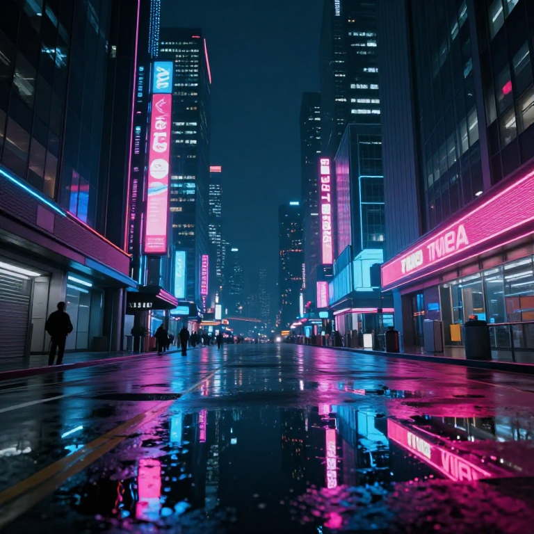

# Z-Go Universal Orchestrator

> **A portable, hardware-aware text-to-image generator powered by Z-Image-Turbo**

[](https://python.org)
[](https://gradio.app)
[](LICENSE)

---

## 📖 About This Project

Z-Go is a **local, privacy-first** text-to-image generation application that runs entirely on your machine. No cloud APIs, no data leaving your computer. It uses the powerful **Z-Image-Turbo** model with GGUF quantization for efficient inference on consumer hardware.

### ✨ Key Features

- 🚀 **Instant UI Launch** - Gradio interface loads immediately (lazy model loading)
- 🎛️ **Speed Controls** - Adjustable steps (4-12) and resolution (512-1024px)
- 🍎 **Apple Silicon Optimized** - Native MPS acceleration on M1/M2/M3 Macs
- 💾 **Memory Efficient** - 4-bit GGUF quantization (~5GB VRAM/RAM)
- 🧠 **MPS Memory Optimizations** - Attention slicing, cache clearing, and high watermark tuning
- 🔒 **100% Local** - No internet required after model download

---

## 📓 Educational Notebook

New to diffusion models? Start with **`z_go_explained.ipynb`** - a beginner-friendly Jupyter notebook in which i tried to explain:

- How diffusion models generate images from noise
- What GGUF quantization is and why it matters
- Hardware acceleration (CUDA, MPS, CPU) explained
- Memory optimization techniques for Apple Silicon
- Step-by-step walkthrough of the generation pipeline

The notebook mirrors `app.py` but includes detailed comments and explanations for every concept. Perfect for learning!

```bash
# Open the notebook
jupyter notebook z_go_explained.ipynb
```

---

## 🤖 About Z-Image-Turbo

**Z-Image-Turbo** is a 6-billion parameter text-to-image diffusion model developed by **Tongyi MAI (Alibaba Group)**. It's part of the Z-Image family, which represents state-of-the-art Chinese-developed generative AI.

### Model Specifications

| Attribute | Value |
|-----------|-------|
| **Parameters** | 6 Billion |
| **Architecture** | DiT (Diffusion Transformer) with Flow Matching |
| **Base Resolution** | 1024×1024 |
| **Inference Steps** | 4-8 (Turbo distilled) |
| **Quantization** | GGUF Q4_K_M (4-bit) |
| **File Size** | ~5 GB |

### Why "Turbo"?

The Turbo variant is **distilled** from the full model to require fewer inference steps:
- Original model: 20-50 steps
- Turbo model: **4-8 steps** (5-10x faster!)

This is achieved through **consistency distillation**, training the model to produce high-quality outputs in fewer denoising steps.

### GGUF Quantization

GGUF (GPT-Generated Unified Format) is a file format for quantized models:
- **Q4_K_M**: 4-bit quantization with medium precision
- Reduces model size from ~24GB → ~5GB
- Minimal quality loss for significant speed gains

---

## 🎓 How It Works (Learning Section)

### The Diffusion Process

Text-to-image generation with diffusion models works in reverse:

```
Noise → Denoise → Denoise → ... → Image
  ^         ^         ^
  |         |         |
  t=T      t=T-1     t=1      t=0 (final image)
```

1. **Start with pure noise** (Gaussian random pixels)
2. **Condition on text** (your prompt gets embedded)
3. **Iteratively denoise** (each step removes a bit of noise)
4. **Final image emerges** from the denoising process

### Key Components

```
┌─────────────────────────────────────────────────────────┐
│                    Z-Image-Turbo                        │
├─────────────────┬───────────────────┬──────────────────┤
│  Text Encoder   │   DiT Backbone    │      VAE         │
│  (Qwen-based)   │  (Transformer)    │   (Decoder)      │
├─────────────────┼───────────────────┼──────────────────┤
│ "A sunset..."   │  Noise → Image    │ Latent → Pixels  │
│  → Embeddings   │  (diffusion)      │  (upscale)       │
└─────────────────┴───────────────────┴──────────────────┘
```

1. **Text Encoder**: Converts your prompt into numerical embeddings
2. **DiT Backbone**: The main transformer that does the denoising
3. **VAE Decoder**: Converts latent representations to full-resolution pixels

### Why Lazy Loading?

```python
# Instead of loading at startup:
pipeline = load_model()  # ❌ Blocks UI for 1-2 minutes

# We load on first use:
def generate():
    if pipeline is None:
        pipeline = load_model()  # ✅ Only when needed
    return pipeline.generate(...)
```

This pattern provides **instant UI feedback** while deferring heavy computation.

---

## 🚀 Installation

### Prerequisites

- Python 3.10 or higher
- 16GB RAM minimum (8GB for smaller resolutions)
- ~6GB disk space for model weights

### Quick Start

```bash
# Clone the repository
git clone [https://github.com/vikramlingam/z-go-orchestrator.git](https://github.com/vikramlingam/Z-Go-Universal-Orchestrator)
cd Z-Go-Universal-Orchestrator

# Create virtual environment (recommended)
python -m venv venv
source venv/bin/activate  # On Windows: venv\Scripts\activate

# Install dependencies
pip install -r requirements.txt

# Run the application
python app.py
```

### Dependencies

```
gradio>=4.0.0
huggingface_hub
torch
diffusers (from git)
accelerate
transformers
safetensors
peft>=0.17.0
gguf>=0.10.0
Pillow
```

> **Note**: Diffusers must be installed from git for Z-Image support:
> ```bash
> pip install git+https://github.com/huggingface/diffusers
> ```

---

## 🎮 Usage

### Starting the App

```bash
python app.py
```

The app will:
1. ✅ Launch Gradio UI instantly at `http://localhost:7860`
2. ✅ Open your browser automatically
3. ⏳ Download model (~5GB) on first generation
4. 🎨 Generate images!

### Speed Guide

| Resolution | Steps | Time (M3 Mac) | Quality |
|------------|-------|---------------|---------|
| 512×512 | 4 | ~35 sec | Good |
| 512×512 | 6 | ~50 sec | Better |
| 768×768 | 6 | ~1.5 min | Good |
| 768×768 | 8 | ~2 min | Great |
| 1024×1024 | 8 | ~4 min | Best |

### Prompt Tips

```
✅ Good prompts:
"A serene Japanese garden with cherry blossoms, golden hour lighting, photorealistic"
"Portrait of a cyberpunk warrior, neon lights, detailed, 8k quality"

❌ Avoid:
"garden" (too vague)
"make it good" (not descriptive)
```

### Sample Outputs

| Japanese Garden | Cyberpunk Warrior |
|:---------------:|:-----------------:|
|  |  |
| *"A serene Japanese garden with cherry blossoms, golden hour lighting, photorealistic"* | *"Portrait of a cyberpunk warrior, neon lights, detailed, 8k quality"* |

---

## 📁 Project Structure

```
z-go-orchestrator/
├── app.py                  # Main Gradio application
├── z_go_explained.ipynb    # Educational notebook (start here!)
├── requirements.txt        # Python dependencies
├── README.md               # This file
└── weights/                # Downloaded models (auto-created)
    └── z_image_turbo-Q4_K_M.gguf
```

---

## 🔧 Technical Details

### Hardware Detection

The app automatically detects your hardware:

```python
if torch.cuda.is_available():
    device = "cuda"      # NVIDIA GPU
elif torch.backends.mps.is_available():
    device = "mps"       # Apple Silicon
else:
    device = "cpu"       # Fallback
```

### MPS Memory Optimizations

Apple Silicon users benefit from several memory optimizations:

```python
# Disable memory limit cap for MPS
os.environ["PYTORCH_MPS_HIGH_WATERMARK_RATIO"] = "0.0"

# Enable attention slicing (breaks large attention into chunks)
pipeline.enable_attention_slicing("max")

# Clear MPS cache after each generation
torch.mps.empty_cache()
gc.collect()
```

These optimizations prevent OOM errors at higher resolutions (768×768, 1024×1024).

### Model Loading Pipeline

```python
# 1. Load GGUF quantized transformer
transformer = ZImageTransformer2DModel.from_single_file(
    "weights/z_image_turbo-Q4_K_M.gguf",
    quantization_config=GGUFQuantizationConfig(compute_dtype=torch.bfloat16),
)

# 2. Create full pipeline with base model components
pipeline = ZImagePipeline.from_pretrained(
    "Tongyi-MAI/Z-Image-Turbo",
    transformer=transformer,
)

# 3. Move to device and enable memory optimizations
pipeline.to("mps")
pipeline.enable_attention_slicing("max")
```

---

## 🤝 Contributing

Contributions are welcome! Please feel free to submit a Pull Request.

1. Fork the repository
2. Create your feature branch (`git checkout -b feature/amazing-feature`)
3. Commit your changes (`git commit -m 'Add amazing feature'`)
4. Push to the branch (`git push origin feature/amazing-feature`)
5. Open a Pull Request

---

## 📚 Learn More

- [Diffusion Models Explained](https://lilianweng.github.io/posts/2021-07-11-diffusion-models/)
- [GGUF Format Documentation](https://github.com/ggerganov/ggml/blob/master/docs/gguf.md)
- [Hugging Face Diffusers](https://huggingface.co/docs/diffusers)
- [Z-Image-Turbo on HuggingFace](https://huggingface.co/Tongyi-MAI/Z-Image-Turbo)

---

## 📄 License

The Z-Image-Turbo model is subject to its own license from Alibaba/Tongyi MAI.

---

## 🙏 Acknowledgments

- **Tongyi MAI (Alibaba)** - For creating Z-Image-Turbo
- **Hugging Face** - For the Diffusers library
- **GGML/llama.cpp community** - For GGUF quantization
- **Gradio** - For the beautiful UI framework

---

## 👤 Author

**Vikram Lingam**

---
